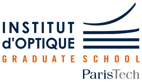

# AI & Deep Learning Course

[Institut d'Optique Graduate School](https://www.institutoptique.fr)

## Lecture 1

- [Introduction to Machine Learning](https://www.bpesquet.fr/mlhandbook/fundamentals/introduction_to_machine_learning.html)
- [Machine Learning in action](https://www.bpesquet.fr/mlhandbook/fundamentals/machine_learning_in_action.html)

## Practical 1

- [NumPy](https://www.bpesquet.fr/mlkatas/tools/numpy.html)
- [pandas](https://www.bpesquet.fr/mlkatas/tools/pandas.html)
- [Predict housing prices](hhttps://www.bpesquet.fr/mlkatas/models/boston_housing.html)
- [Associate flowers with their classes](https://www.bpesquet.fr/mlkatas/models/iris.html)
